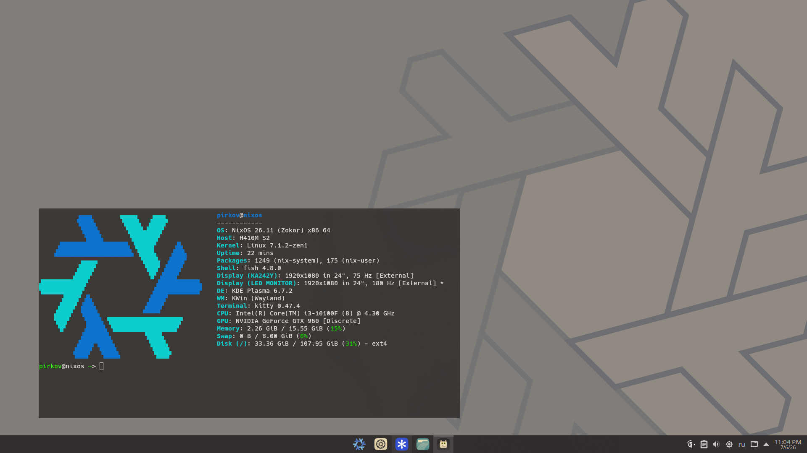

# nixos-configuration

Мой NixOS-конфиг на flakes + home-manager.



## Стек

- **KDE Plasma 6** (Wayland) + `plasma-manager` — тема, курсор, шорткаты, splash
- **kitty** — прозрачность, блюр, без декораций
- **Spicetify** (`lastfm`, `spicyLyrics`)
- **NVIDIA** (legacy 580, modesetting, DRM)
- **Zen kernel**
- **fish** как шелл + алиасы (`nixconf`, `nix-switch`)
- Пакеты: discord, obsidian, telegram, proton-vpn, vscodium, helium, pano-scrobbler и т.д.

## Структура

```
flake.nix           # входы (nixpkgs, home-manager, plasma-manager, spicetify-nix, helium, pano-scrobbler)
configuration.nix    # система: boot, nvidia, юзер, пакеты, sound
home.nix             # home-manager: plasma, kitty, шорткаты
hardware-configuration.nix
```

## Установка

```bash
sudo nixos-rebuild switch --flake .#nixos
```
